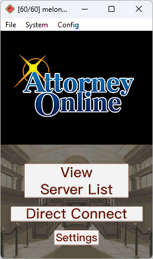
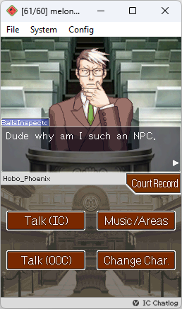

# ao-nds

[Attorney Online](https://aceattorneyonline.com) client for the Nintendo DS.

Made with devkitARM & libnds by Headshotnoby 
Additional code by stonedDiscord 
UI design by Samevi

## Assets and libraries used
* "Igiari" font by [Caveras](https://caveras.net)
* "AceName" font by unknown (found on [webAO](https://github.com/AttorneyOnline/webAO))
* [libnds](http://github.com/devkitPro/libnds)
* [dswifi](http://github.com/devkitPro/dswifi)
* [stb_truetype](https://github.com/nothings/stb/blob/master/stb_truetype.h)
  * Using a modified version of stb_truetype that replaces (some, not all) floating point math with fixed-point math, thus providing a speed boost, since the DS doesn't have a FPU
* MP3 player from this [blogspot](http://adshomebrewersdiary.blogspot.com/2012/06/mp3-streaming-on-arm7.html) site, but with several bug fixes
* [dr_wav](https://github.com/mackron/dr_libs/blob/master/dr_wav.h) for reading WAV audio files
* [rapidjson](https://github.com/Tencent/rapidjson), used when parsing the public server list
* [mINI](https://github.com/metayeti/mINI) for parsing .ini files
* [mongoose](https://github.com/cesanta/mongoose) for WebSocket support
* [utfcpp](https://github.com/nemtrif/utfcpp) for UTF8/16/32 strings
